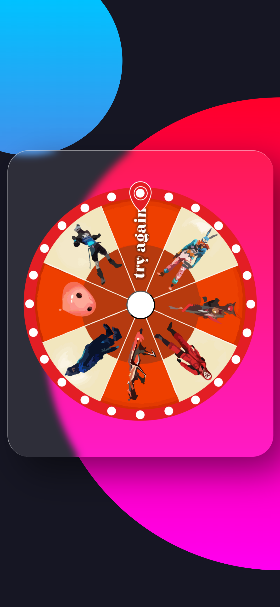
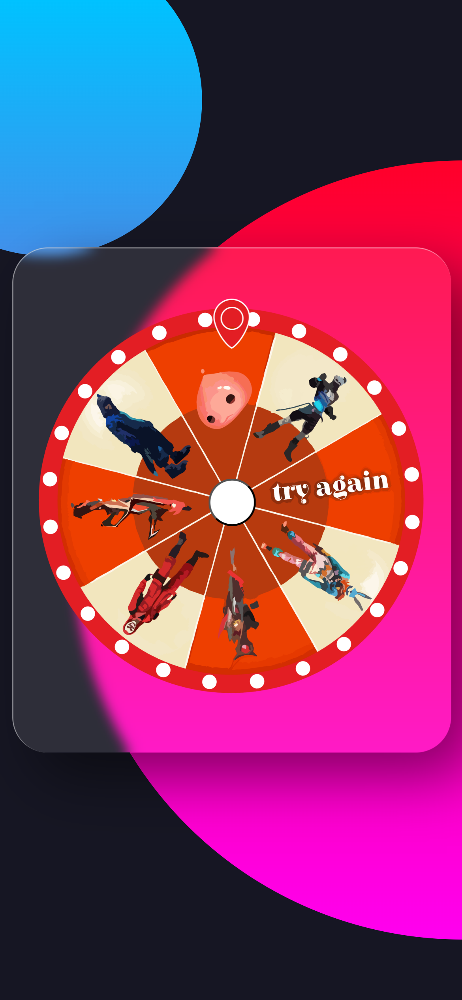

# Luck Royale

## 🎡 Spin-to-Win Randomizer Wheel

This project provides a sleek, fully responsive, and customizable interactive spin wheel built using modern web technologies (HTML, CSS/Tailwind, and JavaScript). It can be used for various purposes, including promotional giveaways, classroom randomizers, or fun decision-making tools.

## ✨ Features

Fully Responsive: Optimized for both desktop and mobile devices.

Customizable Segments: Easily define the options, colors, and probabilities for each slice of the wheel.

Physics-Based Spin: Uses JavaScript to simulate realistic, decelerating spin physics.

Real-time Results: Clearly displays the winning segment upon stopping.

Interactive Controls: Simple UI for adding options and starting the spin.

## ⚙️ Technologies Used

HTML5: Structure and content.

Tailwind CSS: For all styling and responsive layout. (Loaded via CDN).

JavaScript (ES6): Core logic for spin mechanics, canvas drawing, and interaction handling.

Canvas API: Used to render the dynamic, colorful wheel segments and text.

## 🤝 Contributing

Contributions are welcome! If you have suggestions for new features, better physics, or improved aesthetics, please feel free to fork the repository and submit a pull request.

## 📸 Screenshots

<!-- Portrait Screenshots -->

  
  

## 👤 Developer
**Mohammad Hussain**  
GitHub: [@devsQUE](https://github.com/devsQUE)
